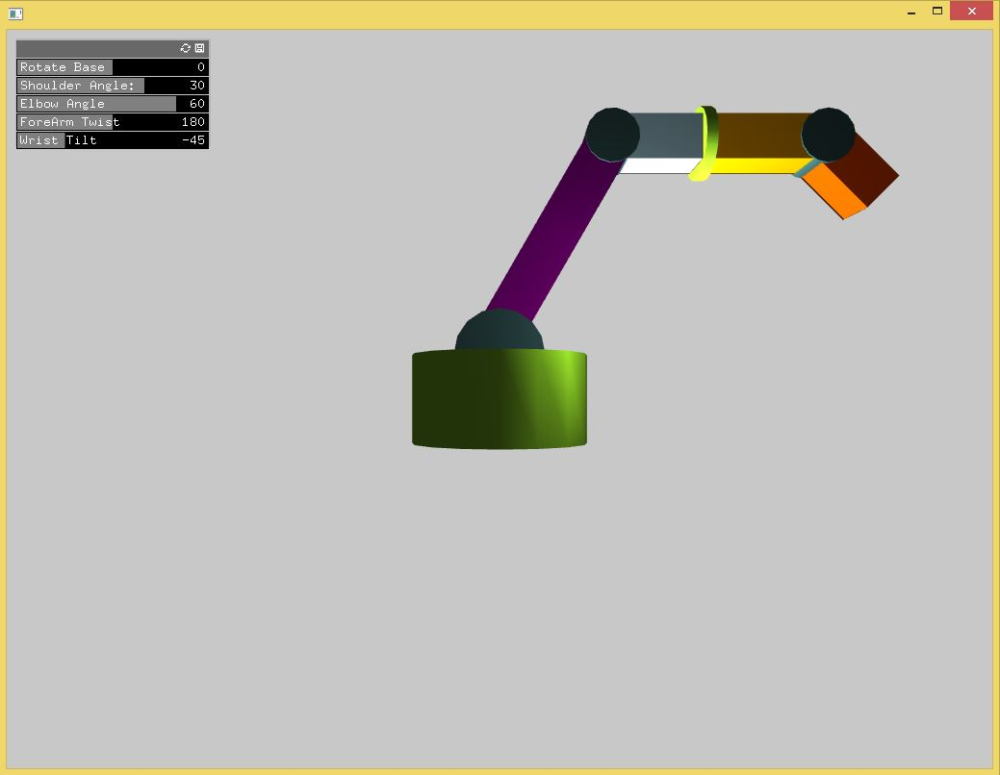

# robotArm addon
This is an addon for openframeworks for visualiing a robotic arm.



## Usage

An example is provided in the example folder. To change the default settings for the arm you can use the following functions:

```c++
//in header file define the arm
	PD::RobotArm arm;
```

```c++
//in ofApp.cpp
void ofApp::setup(){
	// code
	float width = ofGetWidth() * .12;
	arm.setup(width);	//this will create an arm with some default sizes

	//The following are some of the functions you can use to change the various dimensions
	//for the base, foreArmTwist, and aesthetic joints (baseJoint, elbowJoint, wristJoint) you can use the following
	arm.base.setHeight(<float>);
	arm.foreArmTwist.setRadius(<float>);

	//for the other linkages: lowerArm, upperArm, lowerWrist, upperWrist
	arm.lowerArm.setDepth(<float>);
	arm.upperArm.setWidth(<float>);
	//etc

}
```

# API

The arm consists of two basic objects: `PD::Linkage` - rectangular linkages, and `PD::BaseLinkage` - for rotational linkages.

## PD::Linkage

The `PD::Linkage` class has the following methods:

### setup(float base, float newDepth, bool enableXray);

This function is called during `PD::RobotArm::setup()`

- `base` <float> - defines the size of the square base of the rectangular linkage
- `newDepth` <float> - defines the length of the rectangular linkage
- `enableXray` <bool> - enables or disables (disabled on default) showing the xyz gizmo (used for positioning and confirming rotation axis`)

### draw();

Draws the linkage onto the screen. `draw` is called from the parent `RobotArm` class in `RobotArm::draw()`.

### setColor(ofColor);

Sets the color of the linkage (default purple). Example usage:

```c++
//in ofApp::setup()
arm.setColor(ofColor::blue);
```

### showXray();

Changes the alpha (transparency) for the linkage and enables a flag that draws the xyzWidget. Can be used in a callback function to enable certain (or all) the linkages for debugging.

example:

```c++
arm.lowerArm.showXray();
```

### disableXray();

Reverts the alpha (if it has changed) back to 0 transparency and disables the flag that draws the xyzWidget. Can be used with `showXray` to toggle transparency for certain (or all) the linkages for debugging.

example:
```c++
arm.upperArm.disableXray();
```

### setWidth(float newWidth);

Updates the width using `newWidth` of the square base of the linkage. Should be used during setup to alter the size of the linkage.

example:

```c++
//in ofApp.setup() after setting up arm
float width = ofGetWidth() * .12;
arm.lowerArm.setWidth(width*.5);
```

### setDepth(float newDepth)

Updates the length of the linkage using `newDepth`. Should be used during setup to alter the length of the linkage.

example:

```c++
//in ofApp.setup() after setting up arm object
float width = ofGetWidth * .12;
arm.lowerWrist.setDepth(width*.5);
```

## PD::BaseLinkage

The `PD::Linkage` class has the following methods:

### setRadius(float newRadius);

Updates the radius of the linkage with `newRadius`.

example:

```c++
//in ofApp::setup();
arm.base.setRadius(22);
```

### setHeight(float newHeight)

Updates the height of the linkage with `newHeight`.

example:

```c++
//in ofApp::setup();
arm.foreArmTwist.setHeight(16);
```

### setResolution(int newResolution);

Updates the draw resolution (e.g. number of points on the circular base) with `newResolution`. (Note: default resolution is 16)

example:

```c++
//in ofApp::setup()
arm.base.setResolution(12);
```

### setColor(ofColor)

Sets the color of the linkage (default greenYellow). Example usage:

```c++
//in ofApp::setup()
arm.setColor(ofColor::red);
```

### setup(float newRadius, float newHeight, bool turnXRayOn)

This function is called during `PD::RobotArm::setup()`

- `newRadius` <float> - defines the size of the circular base of the rectangular linkage
- `newHeight` <float> - defines the length of the cylindrical linkage
- `enableXray` <bool> - enables or disables (disabled on default) showing the xyz gizmo (used for positioning and confirming rotation axis`)

### draw()

Draws the linkage onto the screen. `draw` is called from the parent `RobotArm` class in `RobotArm::draw()`.

### showXray()

Changes the alpha (transparency) for the linkage and enables a flag that draws the xyzWidget. Can be used in a callback function to enable certain (or all) the linkages for debugging.

### show disableXray()

Reverts the alpha (if it has changed) back to 0 transparency and disables the flag that draws the xyzWidget. Can be used with `showXray` to toggle transparency for certain (or all) the linkages for debugging.